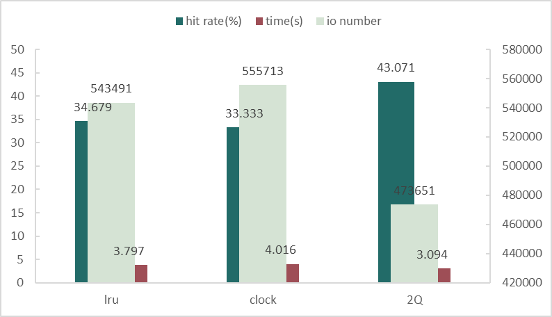

# Storage and Buffer Manager Lab (USTC)

中科大高级数据库大作业——缓冲管理器

## 实验目的

为了了解数据库Buffer的工作原理，对数据库底层有个更加深入的了解，实现一个简单的模拟的缓冲管理器，本次试验涉及到缓冲管理器，缓冲技术，散列技术，文件存储结构，磁盘空间等。

## 实验要求

1. 按[文档](http://kdelab.ustc.edu.cn/~jpq/courses/adb-cs/adbs-lab.pdf)要求实现一个Storage and Buffer Manager，要求至少实现LRU算法。

2. 底层文件默认采用目录式堆文件。

3. 建议先构建一个5万个page（页号从0到49999）的堆文件（使用自己实现的FixNewPage()接口），然后再运行trace文件：[data-5w-50w-zipf.txt](http://kdelab.ustc.edu.cn/~jpq/courses/adb-cs/data-5w-50w-zipf.rar)（包含了50万次满足Zipfan分布-0.8的页面请求，即80%的请求集中在前20%的页号上），根据设计文档要求统计磁盘IO、Buffer命中率、运行时间等数据。

4. *下面的实验为选做内容，不做强制要求。如果完成了选做实验（一个或者多个），最后实验成绩会根据完成的情况适当加分：
   （1）实现CLOCK、LRU-2、LIRS等其它缓存置换算法（至少一种），并与LRU算法的性能进行对比；
   （2）加入缓存请求时的并发控制，通过内存锁(latch)解决缓存访问时的冲突；要求通过多线程方式执行trace并给出测试结果。

## 实验环境

| CPU         | Intel(R) Xeon(R) Silver 4110 CPU @ 2.10GHz |
| ----------- | ------------------------------------------ |
| 操作系统    | Ubuntu 20.04.3   (64位)                    |
| C/C++编译器 | gcc version 9.4.0                          |

## 设计思路

本实验要求实现一个缓冲区管理器，实验说明文档中给出了详细的介绍。主要有两个类：Data Storage Manager和Buffer Manager。每个类都有详细的接口说明，在文档的基础上，拓展了几个函数，均为多次出现的功能模块，以便代码逻辑更加清晰。为了实现多个替换算法，实验中添加了一个ReplaceAlg基类，并派生出三个具体的替换算法类：LPUReplaceAlg，TwoQReplaceAlg，ClockReplaceAlg。实验中用C++自带的内存锁解决了并发请求时缓存访问时的冲突，并采用openMP使用多线程调用接口以模拟并发请求。

下面将详细介绍每个类的实现以及用到的相关技术。

### 页面结构

按照实验说明中，用固定长度字节数组模拟页面，每个页面大小固定为4KB，内存中页框大小也为4KB。

```c++
// common.h
#define FRAMESIZE 4096 // 页框大小
#define PAGESIZE 4096  // 页面大小
struct bFrame	// 存储页面字节数据
{
    char field[FRAMESIZE];
};
typedef int frame_id_t; // 页框号
typedef int page_id_t;	// 页面号
```

### 缓存控制块 BCB

删除了BCB中的内存锁字段，改用C++实现好的内存锁保证多线程安全。

```c++
// common.h
struct BCB
{
    int page_id;
    int frame_id;
    // int latex; // 内存锁
    int count;   // 引用计数
    int dirty;   // 是否修改
    BCB *next;

    BCB() : page_id(-1), frame_id(-1), count(0),
            dirty(0), next(nullptr){};
    BCB(int pid, int fid) : page_id(pid), frame_id(fid), count(1),
                            dirty(0), next(nullptr){};
};
```

### Data Storage Manager

这个类模拟的是磁盘I/O的功能。

数据存储采用**目录式堆文件**结构。堆文件组织中记录是无序的，每一次插入数据都插入到文件尾部，删除数据时将被删除的页面做一个标记。当数据块已满时，可以选择标记已删除的页面存储新记录。

为了配合buffer manager中申请新页面FixNewPage函数的需求，这里在磁盘数据管理器类新加了一个NewPage()函数接口。

- 当磁盘仍有空闲盘块时返回新页面号；
- 当磁盘无空闲盘块时根据pages_table_数组记录的磁盘使用情况，清除无用数据，返回可以被重新使用的页面号；
- 以上都不满足则返回错误信号

ReadPage()和WritePage()函数分别调用fread()和fwrite()对文件进行读写，其他也都按照说明文档中的解释进行实现。

具体函数接口如下：

```c++
// common.h
#define MAXPAGES 50000          // 磁盘最大页数
// DSMgr.h
class DSMgr
{
public:
    DSMgr(string filename);
    ~DSMgr();

    page_id_t NewPage(); // 在磁盘上申请新的页面
    bFrame ReadPage(int page_id);
    int WritePage(int page_id, const bFrame &frm);
    int GetNumPages();

    void SetUse(int index, int use_bit);
    int GetUse(int index);

private:
    FILE *curr_file_;
    int num_pages_;             // 记录当前使用的页面数
    int pages_table_[MAXPAGES]; // 记录页面使用情况

    int Seek(int offset, int pos);
    int OpenFile(string filename);
    int CloseFile();
    FILE *GetFile();
    void IncNumPages();
};

#endif // DSMGR_H
```

### Buffer Manager

BMgr类模拟缓冲管理器，实现具体的请求页面、页面替换、页面调入等功能。定义缓存区能存放的最大页面数为1024。用一个bFrame数组模拟缓冲池，用于存放所有调到缓冲区的页面数据。

每个调入的页面都需要一个控制块BCB来记录访问和控制信息等，为了快速查询页面是否在缓冲区中，使用了**静态哈希表+链地址法（拉链法）**解决冲突。增加了有关BCB的4个内部函数：

- BCB *CreateBCB(int page_id, int frame_id) 在调入页面时调用该函数以创建BCB，初始化并将其加入到哈希表中
- bool RemoveBCB(int frame_id) 在替换页面时调用该函数，将BCB从哈希表中取下，释放旧页面的控制信息
- BCB *SearchBCB(int frame_id) 根据已存在的frame_id查找记录访问控制信息的BCB地址
- BCB *SearchPage(int page_id) 根据页号查找页面是否在内存中，如果已调入内存则返回BCB，否则返回NULL

除此之外还将页面调入与调出包装成两个内部函数：

- BCB *LoadPage(int page_id, int frame_id) 实现调入页面功能。步骤为：调用磁盘读入页面功能，返回页面数据后将数据写入缓存区，创建BCB。
- bool DeletePage(int frame_id) 实现从缓存区移除页面功能。首先查找页面BCB，如果页面不存在或者正在被访问则返回；如果页面存在，则检查修改位，如果被修改则将其写回磁盘，之后删除BCB并返回。

在上述基础上实现了页面请求访问、页面创建、页面访问完毕三个函数：

- frame_id_t FixPage(int page_id, int op_type) 请求访问页面，page_id表示访问的页号，op_type表示访问操作（读0/写1）。首先需要查找页面是否在内存中，如果在并且没有其他用户访问时则将其锁定；如果页面不在内存则将其调入内存，分配内存页框，创建BCB等。页面锁定表示该页面正在访问，无法被替换。
- frame_id_t FixNewPage(int &page_id) 申请新的页面存放数据。相比较FixPage函数，FixNewPage需要先向磁盘管理器申请空闲页面，然后执行FixPage中调入页面的后续步骤。
- frame_id_t UnfixPage(int page_id) 结束访问页面，表示该页面已经被访问完毕。如果当前没有用户访问该页面，则解除页面锁定，此时该页面可以被替换算法选中替换。为了减少IO开销，在页面访问结束后并不会立即将被修改的页写回磁盘，只在该页被置换或者Buffer Manager即将被释放时写回磁盘。

BMgr类函数接口如下：

```c++
// common.h
#define DEFBUFSIZE 1024         // 缓存最大页数
// BMgr.h
class BMgr
{

private:
    bFrame buffer_pool_[DEFBUFSIZE]; // buffer pool: 模拟内存缓冲池
    int fid_to_pid_[DEFBUFSIZE];     // Hash Table: frame_id to page_id, default value -1
    BCB *pid_to_bcb_[DEFBUFSIZE];    // Hash Table: page_id to BCB chain head

    ReplaceAlg *replace_alg_; // 替换算法类指针
    DSMgr *disk_manager_;     // 磁盘管理器类指针
    int num_io_;              // 系统I/O次数 包括从磁盘读入和写入磁盘
    int num_hits_;            //  页面命中次数
    mutex latch_;             //  保证多线程安全

    // Internal Functions
    // 1. About Frame
    frame_id_t NewFrame();     // 分配内存页框
    frame_id_t SelectVictim(); // 选择替换页面
    int Hash(int page_id);
    void PrintFrame(int frame_id);

    // 2. About page and BCB
    BCB *LoadPage(int page_id, int frame_id); // 从磁盘加载页面到缓存
    bool DeletePage(int frame_id);            // 从缓存移除某一页面
    BCB *CreateBCB(int page_id, int frame_id);
    bool RemoveBCB(int frame_id);
    BCB *SearchBCB(int frame_id);
    BCB *SearchPage(int page_id);
    // 3. About operation
    void SetDirty(int frame_id);
    void UnsetDirty(int frame_id);
    void WriteDirtys();

public:
    BMgr(string filename, int alg = Policy::Lru);
    ~BMgr();

    // Interface functions
    frame_id_t FixPage(int page_id, int op_type);
    frame_id_t FixNewPage(int &page_id);
    frame_id_t UnfixPage(int page_id);

    int NumFreeFrames();
    int GetIONum() { return num_io_; }
    int GetHitNum() { return num_hits_; }
    int GetNumPages() { return disk_manager_->GetNumPages(); }
};
```

### 页面替换算法

将所有页面替换算法抽象为一个父类，向buffer maneger提供相同的功能接口，在不同的子类中进行不同的实现。主要有一下几种功能接口：

```c++
// common.h
class ReplaceAlg
{
public:
    ReplaceAlg() = default;
    virtual ~ReplaceAlg() = default;
    virtual frame_id_t Victim() = 0;  		// 选择替换页面
    virtual void Pin(int frame_id) = 0; 	// 标记正在访问页面 无法被选为替换页面
    virtual void Unpin(int frame_id) = 0; 	// 标记页面访问完毕 可以被选为替换页面
};
```

下面分别对实现的三个替换算法的实现简要介绍：

#### LRU算法

首先，最近访问的页号需要使用一个数据结构来存储，考虑到它需要不断的插入和删除，特别是需要头插和尾删，因此使用双向链表是比较方便的。另外，可以增加一个哈希表来加快查找和定位的速度。综合考虑，使用**哈希表+双向链表**来完成比较合适。

- 哈希表：完成从页号到链表节点的映射。它的作用有两个，一是方便查找某个页面当前是否在这个链表当中；另一个是能够快速定位到当前页面在链表中的位置，方便删除操作。
- 双向链表：便于对节点进行插入和删除操作。双向链表负责维护一个页面的集合，数据按照从最近使用过的到最近没有使用的来排序。因此，每当更新某个页面的时候，都应该把它放在双向链表的头部，即使是某个页面已经出现在链表中，也要拿出来，重新放置。每当置换的时候，都应该从双向链表的尾部置换页面，取出最近没有使用的页面。
- 使用哈希表+双向链表查找、删除、插入的时间复杂度都为O(1)

定义 LPUReplaceAlg 的数据结构如下：

```c++
class LPUReplaceAlg : public ReplaceAlg
{
    struct ListNode // 双向链表节点
    {
        int frame_id;
        ListNode *prev, *next;
        ListNode(int v = -1) : frame_id(v), prev(nullptr), next(nullptr) {}
    };

public:
    LPUReplaceAlg();
    ~LPUReplaceAlg();
    frame_id_t Victim();				// 选择替换节点
    void Pin(int frame_id);				// 页面正在被访问
    void Unpin(int frame_id);			// 页面访问结束

private:
    ListNode *fid_to_node_[DEFBUFSIZE]; // hash table : frame_id to Listnode pointer
    ListNode *head_, *tail_;            // 双向链表头尾指针
    mutex latch_;                       // 为了线程安全需要加的锁

    void pop_node();					// 删除链表末尾节点
    void push_node(ListNode *new_node); // 将节点插入到头部
};
```

接口实现思路：

- frame_id_t Victim()：选择最后一个链表节点作为替换节点，将其从链表中删除。没有节点则返回-1。
- void Pin(int frame_id)：表示页面正在被访问。查找该页面是否在链表中，如果存在则移除链表节点，表示页面正在访问，此时无法被选为victim，可以保证正在访问的页面不会被替换。
- void Unpin(int frame_id)：表示页面访问结束。在链表头部插入该节点。因为每次访问页面都会将节点从链表中删除再插入，所以最近访问的页面会一直保持在链表的头部，很久没被访问的页面节点会在链表的尾部，从而按照淘汰算法被选中替换。

#### Clock算法

`Clock` 也是页面置换算法的一种。`Clock` 置换算法分为两种，一种是简单的置换算法，与 `LRU` 算法类似。另一种是改进型的，相比于前一种，减少了磁盘IO，性能更加高效。

- 简单 `Clock` 的思想是先将内存中的所有页面想象成一个环形队列，通过维护一个访问位，每次更新的时候，如果访问位为 0，表示最近没有被访问，则可以置换；否则，将访问位置 0，继续寻找。

- 改进版的思想是，需要添加一个修改位，修改了的置 1 ，没有则置 0 。那么当要置换时，（访问位，修改位）可能的组合按优先级分为以下四种：（0,0）、（1,0）、（0,1）、（1,1）。因此，它的执行过程是：（1）循环扫描查找（0,0）。有则退出。如果访问位为1则置 0 。（2）循环扫描查找（0，1）。有则退出。如果访问位为1则置 0 。（3）重复第一步。

这里只考虑简单的 Clock 设计思路：

- 维护一个环形链表和一个定位指针`cptr_`，每次从指针处开始循环查找当前需要被置换的页面。同样，维护一个哈希表`fid_to_node_`完成从frame_id到链表节点的映射。
- 由于Clock比LRU多维护一个**访问位**`ref`，所以不能简单地将正在访问的页面从链表上删除，这样会丢失访问位信息，访问结束后无法恢复。所以这里给每个节点再添加一个**引用位**`isPin`，用于记录当前 frame 是正在被引用。在访问页面时将其标记为True，选取victim时跳过正在被引用的页面，从而保证正在访问的页面不会被替换。

根据上面 Clock 的设计思路，定义出 ClockReplaceAlg 的数据结构：

```c++
class ClockReplaceAlg : public ReplaceAlg
{
    struct ListNode
    {
        int frame_id;
        ListNode *prev, *next;
        bool ref;   // ref 表示当前的 frame 最近是否被使用过
        bool isPin; // isPin 表示当前 frame 是正在被引用

        ListNode(int v = -1) : frame_id(v), prev(nullptr), next(nullptr), ref(false), isPin(true) {}
        // isPin = true 页面加载到 Buffer pool 时，一定是因为 page 被引用了
        // ref = false 因为当前这个 page 的引用还没有结束
    };

public:
    ClockReplaceAlg();
    ~ClockReplaceAlg();
    frame_id_t Victim();
    void Pin(int frame_id);
    void Unpin(int frame_id);

private:
    ListNode *cptr_;                    // clock 指针当前所指位置
    ListNode *fid_to_node_[DEFBUFSIZE]; // hash table: frame_id to node pointer
    mutex latch_;

    bool exists(int frame_id);			// 判断frame_id是否已经存在
};
```

接口实现思路：

- frame_id_t Victim()：
  - 从cptr_循环查找可以被置换的页，如果当前页面正在被引用则跳过；
  - 如果当前页面不在被引用且最近未使用，则可以被置换，从链表上取下该节点，返回页号；
  - 每次扫描都要把最近使用的页面置为false
  - 如果cptr_==NULL则返回-1（无可选节点）
- void Pin(int frame_id)：表示页面正在被访问。
  - 根据哈希表`fid_to_node_`查找该页面是否在链表中
  - 如果存在则标记该页面不能被替换，表示页面正在访问
- void Unpin(int frame_id)：表示页面访问结束。
  - 根据哈希表`fid_to_node_`查找该页面是否在链表中
  - 如果该页面已经在链表中，则更新访问信息，标记访问位为True并取消页面锁定（isPin=false）
  - 如果该页面不在链表中且环上无节点，则创建新节点并将cptr_指向该节点
  - 如果该页面不在链表中且环上有节点，则插入到cptr_之前

#### LRU-2/2Q算法

LRU-K中的K代表最近使用的次数，因此LRU可以认为是LRU-1。LRU-K的主要目的是为了解决LRU算法“缓存污染”的问题，其核心思想是将“最近使用过1次”的判断标准扩展为“最近使用过K次”。相比LRU，LRU-K需要多维护一个队列，用于记录所有缓存数据被访问的历史。只有当数据的访问次数达到K次的时候，才将数据放入缓存。当需要淘汰数据时，LRU-K会淘汰第K次访问时间距当前时间最大的数据。

LRU-K具有LRU的优点，同时能够避免LRU的缺点，实际应用中LRU-2是综合各种因素后最优的选择，LRU-3或者更大的K值命中率会高，但适应性差，需要大量的数据访问才能将历史访问记录清除掉。

2Q算法作为LRU-2一个具体的实现版本，**历史队列**使用**FIFO的淘汰策略**，**缓存队列**使用**LRU-1的淘汰策略**。当数据第一次访问时，2Q算法将数据缓存在FIFO队列里面，当数据第二次被访问时，则将数据从FIFO队列移到LRU队列里面，两个队列各自按照自己的方法淘汰数据。工作原理：


 * 新访问的数据插入到FIFO队列
 * 如果数据在FIFO队列中一直没有被再次访问，则最终按照FIFO规则淘汰
 * 如果数据在FIFO队列中被再次访问，则将数据移到LRU队列头部
 * 如果数据在LRU队列再次被访问，则将数据移到LRU队列头部
 * LRU队列淘汰末尾的数据

2Q算法设计思路：

- 维护一个历史队列和一个缓存队列，使用双向链表实现，并添加头尾节点，方便删除和插入

- 维护一个哈希表`fid_to_node_`完成从frame_id到链表节点的映射，用于快速查找和定位
- 在节点中添加`inCache`字段记录该节点是否在缓存队列中
- 与Clock算法类似，2Q中的节点也要维护`isPin`以标记页面是否在访问。

定义TwoQReplaceAlg的数据结构如下：

```c++
class TwoQReplaceAlg : public ReplaceAlg
{
    struct ListNode
    {
        int frame_id;
        ListNode *prev, *next;
        bool inCache;  // 是否在缓存队列中
        bool isPin;    // 是否在访问
        ListNode(int v = -1) : frame_id(v), prev(nullptr), next(nullptr),
                               inCache(false), isPin(true){};
    };

public:
    TwoQReplaceAlg();
    ~TwoQReplaceAlg();
    frame_id_t Victim();
    void Pin(int frame_id);
    void Unpin(int frame_id);

private:
    ListNode *h_head_, *h_tail_;        // history_ list
    ListNode *c_head_, *c_tail_;        // cache_ list
    ListNode *fid_to_node_[DEFBUFSIZE]; // hash table: frame_id to node pointer
    mutex latch_;
    void freeList(ListNode *head);
    void push_node(ListNode *new_node, ListNode *head);
};
```

接口实现思路：

- frame_id_t Victim()：
  - 优先淘汰历史队列末尾节点：从历史队列尾部向前查找unpin节点，如果找到则删除该节点并返回；
  - 历史队列为空则从缓存队列末尾节点向前淘汰
  - 都为空则返回-1（无可选节点）
- void Pin(int frame_id)：表示页面正在被访问。
  - 根据哈希表`fid_to_node_`查找该页面是否在链表中
  - 如果存在则标记该页面不能被替换，表示页面正在访问
- void Unpin(int frame_id)：表示页面访问结束。
  - 根据哈希表`fid_to_node_`查找该页面是否在链表中
  - 如果页面未访问过，则将其插入到历史队列头部，标记访问结束；
  - 如果页面只访问过一次（在历史队列中），则从历史队列取下该节点，放到缓存队列头部
  - 如果该页面访问过多次（在缓存队列中），则从缓存队列取下该节点，放到缓存队列头部

### 多线程执行

> OpenMP是一个跨平台的多线程实现，主线程生成一系列的子线程，并将任务划分给这些子线程进行执行，在运行时环境将线程分配给不同的处理器。OpenMp提供了对于并行描述的高层抽象，降低了并行编程的难度和复杂度，这样程序员可以把更多的精力投入到并行算法本身，而非其具体实现细节。

对于本实验来说，每行输入都代表一次请求页面操作，每个多线程被看作一个用户，多个线程并发执行时类似于同一时刻有多个用户来请求页面。所以OpenMP的多线程正好能用来模拟运行时的并发请求，只要在读入请求的循环体前加上一条引导语句即可。

```c++
void muti_thread_task(FILE *data_file, BMgr *bmgr, int thread_num)
{
    int op_type;
    int page_id;
#pragma omp parallel for num_threads(thread_num)
    for (int i = 0; i < NUM_PAGR_REQUEST; i++)
    {
        fscanf(data_file, "%d,%d", &op_type, &page_id);
        page_id = page_id % MAXPAGES;
        int frame_id = bmgr->FixPage(page_id, op_type);
        if (frame_id < 0)
            continue;
        bmgr->UnfixPage(page_id);
    }
}
```

**补充：**唯一的缺点是，OpenMP只能用于循环次数固定的for循环，while循环无法被该语句引导，并且for循环并行化仍有很多约束条件，比如：循环必须是单入口、单出口，即循环内部不允许能够达到循环以外的跳转语句（exit除外）；循环变量必须是有符号整形等。不过对于本实验来说，能够确定请求的次数，所以不受影响。

为了方便最终的测试，我使用了轻量级的C++命令行解析库——cmdline。项目托管地址：https://github.com/tanakh/cmdline。只需要将源文件下载到自己的项目中，引入头文件即可使用。

### 并发控制

用多线程执行并发的请求时，多个线程将同时访问内部数据结构，因此需要确保临界区受到保护，实现线程级安全。实验中用C++自带的内存锁解决了并发请求时缓存访问时的冲突：

`std::lock_gurad `

创建 `lock_guard` 对象时，它试图接收给定互斥的所有权。控制离开创建 `lock_guard` 对象的作用域时，销毁 `lock_guard` 并释放互斥。使用方法如下：

```c++
int g_i = 0;
std::mutex g_i_mutex;  // 保护互斥量g_i
 
void safe_increment()
{
    std::lock_guard<std::mutex> lock(g_i_mutex);
    ++g_i;
    std::cout << std::this_thread::get_id() << ": " << g_i << '\n';
    // g_i_mutex 在锁离开作用域时自动释放
}
```

在BMgr类以及ReplaceAlg中分别定义互斥锁`latch_`，并在对外的接口函数中使用

```c++
mutex latch_; // 定义互斥锁
lock_guard<mutex> lock(latch_); //在函数内使用
```

需要实现线程级安全的函数列表如下：

```c++
frame_id_t Victim();
void Pin(int frame_id);
void Unpin(int frame_id);

frame_id_t FixPage(int page_id, int op_type);
frame_id_t FixNewPage(int &page_id);
frame_id_t UnfixPage(int page_id);
```

## 运行说明

- 编译

```shell
mkdir build && cd build/
cmake .. && make
```

- 运行

```shell
$ ./main --help
usage: ./main [options] ... 
options:
  -p, --policy    replacement policy: [lru|clock|2Q] (string [=lru])
  -t, --thread    thread number (int [=1])
  -?, --help      print this message
```

可以在命令行设置替换算法、线程个数。

在根目录下的文件`run`为自动测试脚本，运行以下命令即可测试不同算法在不同线程下的执行情况。

```shell
chmod +x
./run > run.log
```

## 实验结果

### 替换策略比较

在单线程情况下测试不同替换策略的性能，包括磁盘IO、Buffer命中率、运行时间，得到结果如下，可以看到2Q算法的I/O次数最少，命中率最高，运行时间也是少的，综合性能最好。

| policy | io number | hit rate(%) | time(s) |
| ------ | --------- | ----------- | ------- |
| lru    | 552817    | 33.914      | 3.551   |
| clock  | 561828    | 32.883      | 5.155   |
| 2Q     | 470364    | 43.501      | 2.854   |



### 多线程运行

以LRU算法为例，测试不同线程并发执行情况下缓存管理器的命中率、I/O次数以及运行时间。得到结果如下图所示：


可以看出多线程并没有提高程序的运行速度，甚至有所下降，因为每次执行页面请求时都可能会因为缓存访问冲突而阻塞，而且多个线程的开销也会比较大。LRU的平均命中率基本维持在34%左右，当命中率提高时可以看到明显的I/O次数下降。

# 参考链接

- [Lab1 - Buffer Pool Manager](https://aspiring-sovereign-23a.notion.site/Lab1-Buffer-Pool-Manager-848355c2cb584707b8abbcf7356e1c1f)

- [LRU-K和2Q缓存算法介绍](https://www.jianshu.com/p/c4e4d55706ff)